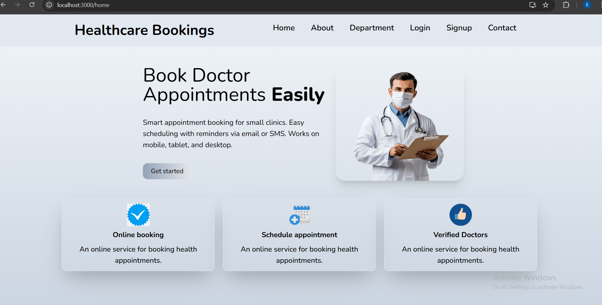
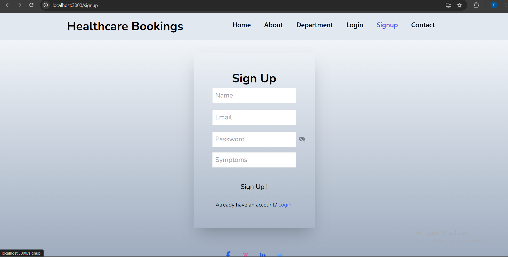
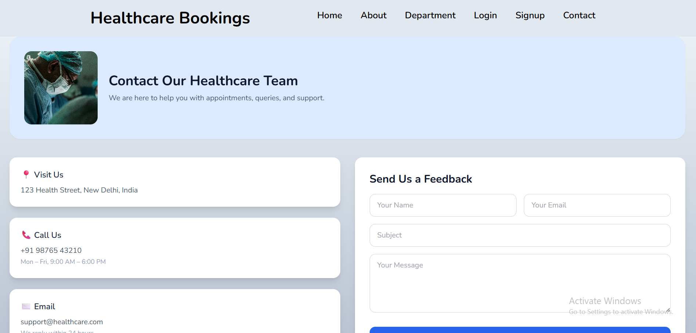

# Healthcare Appointment Booking – Frontend

This frontend application provides an intuitive and user-friendly interface for patients,
doctors, and administrators to manage healthcare appointments efficiently.

## Tech Stack
- React.js
- JavaScript
- HTML
- CSS
- Axios

## Features
- JWT-based user authentication
- Role-based access (Patient / Doctor / Admin)
- Appointment booking workflow
- Responsive and clean user interface

## Screenshots

### Home Page

### Signup Page

### Contact Page

## Folder Structure
- src/
- components/
- pages/
- services/

## Project Status
- Currently runs on localhost
- Deployment planned as a future enhancement

## Getting Started
1. Clone the repository
2. Install dependencies using `npm install`
3. Start the application using `npm start`

## Related Repository
Backend: https://github.com/esha0303/healthcare-appointment-backend
